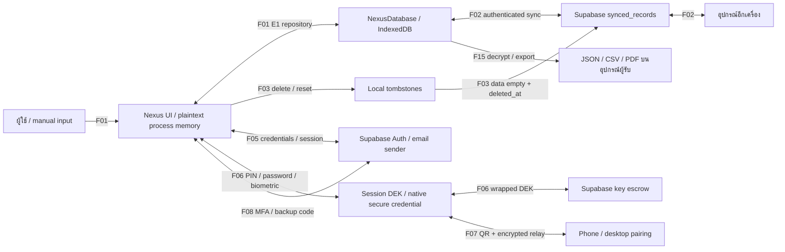
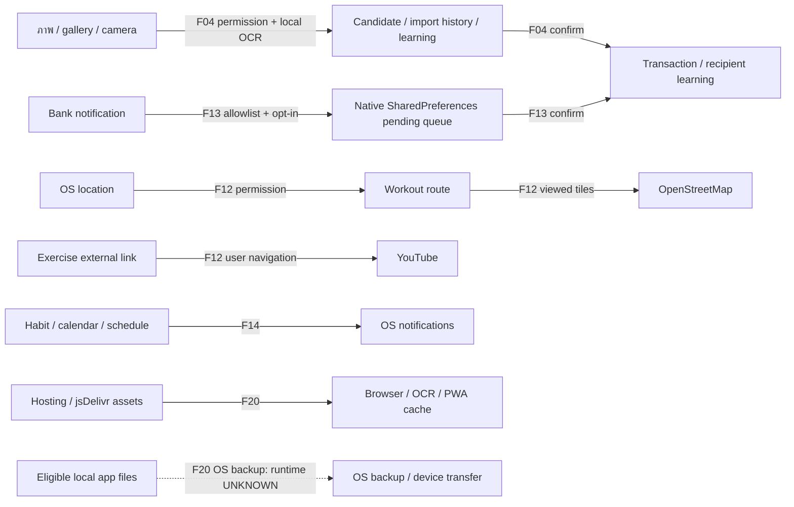
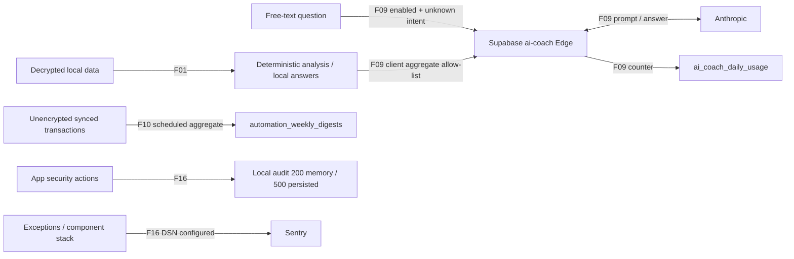
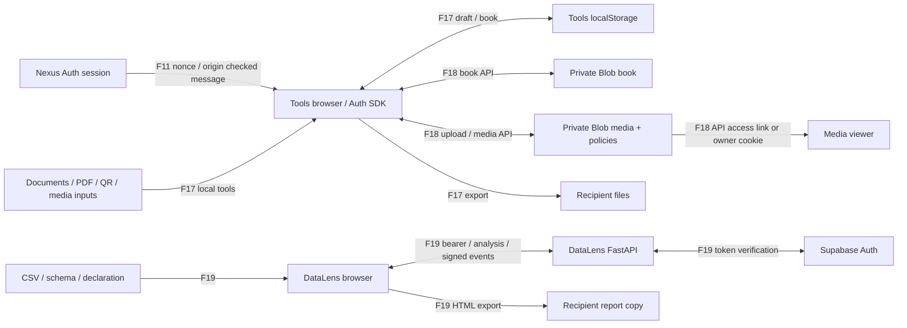

# Data Flow Map — Nexus Suite

**งาน:** DATA-INVENTORY-001 / RB-002  
**วันที่:** 2026-09-12  
**Evidence:** source inspection ของ local working trees; ไม่ใช่ network capture หรือ production verification

[Data Inventory](DATA_INVENTORY_2026-09-12.md) ระบุ D001–D055, fields, storage, retention และ source index N/T/L. [Source manifest](assurance/data-inventory-source-manifest-2026-09-12.json) เชื่อมทุก F ID กับ D IDs แบบ machine-readable. ลูกศรหมายถึง flow ที่ code รองรับ โดยมีเงื่อนไขเปิดใช้ในตาราง ไม่ได้หมายความว่าทุก flow เปิดใน production

## 1. Core data, sync, keys และ deletion

UI memory มี business data หลัง decrypt; IndexedDB มี plaintext หรือ envelope ตาม row/feature. F02 ส่งรูปแบบ row ที่เก็บอยู่ ไม่ได้เพิ่ม encryption ใหม่ระหว่าง sync. F03 สิ้นสุดที่ tombstone propagation; ไม่แสดงว่าลบ remote backups หรือไฟล์ผู้ใช้ครบ

## 2. Sensors, scanning และ external content

Candidate/history/learning มีข้อมูลการเงินหรือข้อความผู้ใช้ตาม D020/D029/D042. NativeBiometric รับ/คืน PIN ผ่าน secure credential API (F06) ไม่ใช่ส่งภาพลายนิ้วมือเข้า OCR หรือ cloud

## 3. Derived data, AI และ telemetry

Aggregate fields ยังอาจระบุตัวเมื่อรวม context และ free text; ไม่มีการรับรอง anonymization. Default-off เป็นค่า source ของ client ไม่ใช่หลักฐานว่า deployment ปิด. Edge/Sentry/provider logs ต้องมี retention evidence แยก

## 4. Tools และ DataLens

F11 ส่ง tokens/theme ไม่ใช่ sync ตาราง Nexus ไป Tools. DataLens มี Auth client ของตนและตรวจ bearer ที่ backend; ไม่พบการส่ง Nexus database ผ่าน DataLens navigation ที่ตรวจ. Private Blob หมายถึง access control ไม่ได้พิสูจน์ content encryption ด้วยกุญแจผู้ใช้. Media expiry แยกจาก physical deletion

## 5. Flow register

| Flow | Input → process → destination | Data assets | Trigger / control | Boundary / deletion limitation | Source refs |
| --- | --- | --- | --- | --- | --- |
| F01 | User / derived engine → React store → repository → IndexedDB → UI | D001, D002, D003, D004, D005, D007, D008, D009, D010, D011, D012, D013, D014, D015, D021, D023, D024, D025, D026, D027, D028, D030, D031, D032, D006, D041 | forms/manual imports/derived computation; E1 encrypt/decrypt ตาม session; merchants และ persisted preferences ใช้ E0 | ผู้ใช้และอุปกรณ์/origin เดียวกัน; memory มี plaintext หลัง read | N01, N02, N07 |
| F02 | IndexedDB ⇄ sync engine ⇄ Supabase synced_records ⇄ device อีกเครื่อง | D001, D002, D003, D004, D005, D007, D008, D009, D010, D011, D012, D013, D014, D015, D021, D023, D024, D025, D026, D027, D028, D030, D031, D032, D017, D033 | configured Supabase + authenticated user; automatic 5s/online; raw stored row plain หรือ encrypted envelope พร้อม user/table/id/time | cross-device trust boundary; metadata ไม่เข้ารหัส; actual deploy/RLS verification UNKNOWN | N04 |
| F03 | User delete/reset → local tombstone → Supabase deleted record → other devices | D016, D017, D033 | push data={} + deleted_at; clear local tombstone หลังส่งสำเร็จ; server trigger ห้าม stale resurrection | ไม่ใช่ purge ตามเวลา/ลบ backup; offline device ต้อง sync จึงรับผล | N03, N04 |
| F04 | Gallery/camera/file → local QR/OCR → candidate/history/learning → confirm → transaction | D001, D005, D018, D019, D020, D029, D042, D045 | user-selected files หรือ native permission; candidates persistence strips thumbnailUrl only; history sums amount; learning corrections persist | ข้อมูลก่อน import ยังเป็น financial/text; reset/discard เคลียร์ current run ไม่ใช่ลบ gallery | N08, N11 |
| F05 | Email/password/OTP → Supabase Auth ⇄ app session / account email | D040, D055 | signup/signin/recovery/OTP; Auth SDK persist session; configured email sender/provider UNKNOWN | credentials/access/refresh/user identity ข้าม device→Auth; emails ออกสู่ mailbox/provider | N04, N05, N06 |
| F06 | PIN/password/biometric → key derivation/secure credential → wrapped DEK escrow ⇄ session DEK | D021, D034, D041, D044 | storeBiometricCredential ส่ง literal PIN ให้ NativeBiometric; recovery unwrap DEK client-side; Supabase เก็บ password-wrapped envelope | biometric template ไม่เข้าสู่ JS interface; plaintext PIN/DEK มีชั่วคราวใน process; hardware/backup assurance UNKNOWN | N02, N06, N07, N10 |
| F07 | Desktop QR secret → phone approve → Supabase encrypted DEK → desktop memory | D035, D041 | QR id+32-byte random secret; secret hash cloud; AES-GCM wrapping; same-user RLS; ticket2นาที | camera/display boundary มี secret; success/cancel delete แต่ abandoned expiry ไม่ใช่ scheduled purge | N06 |
| F08 | TOTP/recovery code → Supabase MFA or redemption RPC → application verified marker | D036, D037, D040 | backup hashes; native TOTP factors in Auth; recovery attempts5/15นาที; code request plaintext over configured transport | Nexus recovery marker ไม่เปลี่ยน JWT aal; provider Auth lifetime UNKNOWN | N05, N04 |
| F09 | Unknown-intent question + aggregate context → ai-coach Edge → Anthropic → answer | D038, D046, D055 | AI opt-in default off + session/config; client context builder allow-list; free-text prompt/labels remain; server length/shape checks | Anthropic sees question/context; Edge increments usage and logs upstream errors; no observed chat DB does not mean no provider logs | N12 |
| F10 | Unencrypted synced transactions → server weekly aggregate → digest table → UI | D033, D039 | generate_weekly_digests skips users with encryption escrow row; cron configuration must be checked | derived income/expense/net remain personal financial data; existing digest retention UNKNOWN | N04 |
| F11 | Nexus popup session → verified-origin postMessage → Tools Auth SDK | D040, D048 | origin + window source + nonce; access/refresh tokens + theme in message; nonce in URL; receiver setSession | tokens cross origin intentionally; no Nexus database payload is sent in this handshake | N06, T01 |
| F12 | OS GPS → workout route → map viewport / external YouTube navigation | D023, D024, D054 | permission/high-accuracy watch; discard accuracy>50m; stop/reset/unmount clears watch; map fetch tile z/x/y; user opens external link | workout route follows E1 sync; tile service sees viewport requests, not route JSON in reviewed call; external provider retention UNKNOWN | N16 |
| F13 | Allowlisted banking app notification → Android pending queue → JS review → transaction | D001, D043 | opt-in flag+OS notification access; read only4 allowed packages; raw strings in SharedPreferences max10; confirm/dismiss acknowledge | notification title/text/bigText are sensitive pre-import copies; own confirmation notification generic | N09 |
| F14 | Habit/calendar/schedule reminder → native schedule → notification display | D011, D013, D014, D053 | native platform + notification permission; title/body/time/repeat/id sent to OS; cancellation API | OS/lock-screen recipient boundary; source record delete/reset not proof all notifications cleared | N15 |
| F15 | Nexus decrypted rows / reports → JSON/CSV/PDF → download/import | D001, D002, D003, D004, D005, D006, D007, D008, D009, D010, D011, D012, D013, D014, D015, D021, D023, D024, D025, D026, D027, D028, D030, D031, D032, D051 | exportBackup25 tables incl merchants/Vault; import max25MiB/250000 rows; validates then overwrites tables and tombstones removed syncIds | recipient/device copies plaintext; no user-controlled export deletion guarantee from app reset | N03 |
| F16 | App actions/errors → local audit + optional Sentry | D022, D041, D047 | audit ring200/persist500; Sentry only with DSN, buffer50, sendDefaultPii:false, componentStack/error extra | local event cap not age TTL; SDK setting not semantic redaction of all strings | N13, N07 |
| F17 | Tools document/file/QR inputs → local transform/book/draft → download | D048, D051 | localData/store persistence; saved documents/contacts/settings; file/QR processing via local UI | ordinary file tool flow differs from deliberate cloud-book/media API paths; browser/download copies outside Nexus DB | T02 |
| F18 | Tools cloud-book / media client ⇄ authenticated APIs ⇄ private Blob → viewer | D040, D048, D049, D055 | book uses user bearer+AAL; media admin upload + optional owner bearer; direct Blob upload token; signed cookie for owner viewer | link access may be usable by anyone with link until expiry; policy expiry blocks read but admin DELETE removes blob; provider backups UNKNOWN | T01, T02, T03 |
| F19 | DataLens CSV/schema → authenticated FastAPI analysis → result/review/approve → HTML | D040, D050, D051, D055 | 10MiB local/4MiB Vercel source limit,100000 rows/100 cols; first100 rows preview; actor metadata+signed audit; HMAC review/approve | request handler lacks durable write; multipart spool/platform logs not proven absent; HTML contains evidence/actor and is editable copy | L01, L02, L03 |
| F20 | Browser/native infrastructure ⇄ hosting/CDN/cache/OS backup | D045, D052, D055 | Workbox static/navigation cache; OCR worker/core/language jsDelivr defaults; Android allowBackup true declaration | source proves request/config paths; runtime enablement, user IP/log metadata, cache/backup recipients/retention UNKNOWN | N11, N14 |

Source refs เปิดได้จาก [Inventory source index](DATA_INVENTORY_2026-09-12.md#8-source-index). Manifest เก็บรายการ assets ต่อ flow แบบไม่ย่อ; all F IDs และ all D IDs ต้องตรวจ resolve ได้

## 6. Boundaries ที่ต้องยืนยันต่อ

1. **Device/process/storage:** UI memory, localStorage, IndexedDB, SharedPreferences, native credential, OS notifications และ OS backup เป็นคนละแหล่ง; global reset ไม่ใช่การลบทั้งหมด
2. **Authenticated cloud:** user JWT/RLS เป็น control ของ cloud data; local database ไม่มี user_id partition ใน 32 table definitions ที่ตรวจ ต้องตรวจ shared-device/account switching ต่อใน RB-007/016/023
3. **Cross-origin session:** postMessage origin/source/nonce ตรวจทั้งสองด้าน; session handoff ต้องรวมใน incident/revocation scope แม้ไม่มี business row ถูกส่ง
4. **Processor/content boundary:** data ที่เข้า AI, Sentry, Blob และ DataLens แยก minimization/retention/region; HTTP no-store ไม่ใช่ห้าม provider เก็บ logs
5. **Recipient copies:** download, shared link, mail, notification display และ OS backup อาจสร้างสำเนาที่ operator ไม่สามารถลบจาก local reset
6. **Production boundary:** source flags, SDK defaults และ SQL scripts ไม่พิสูจน์ actual deployment/config; RB-006/020/021/022 เป็นผู้รับช่วง

## 7. Validation

แผนภาพเป็น static Mermaid จาก flow register. ตรวจ ID consistency, asset coverage, source links, diagram F labels และ selected source hashes; ไม่ได้ render หรือจับ network บน production. ลำดับ retention/legal decisions ยังต้องใช้ผู้รับผิดชอบใน RB-001/005–007/013 ตาม inventory UNKNOWN register

